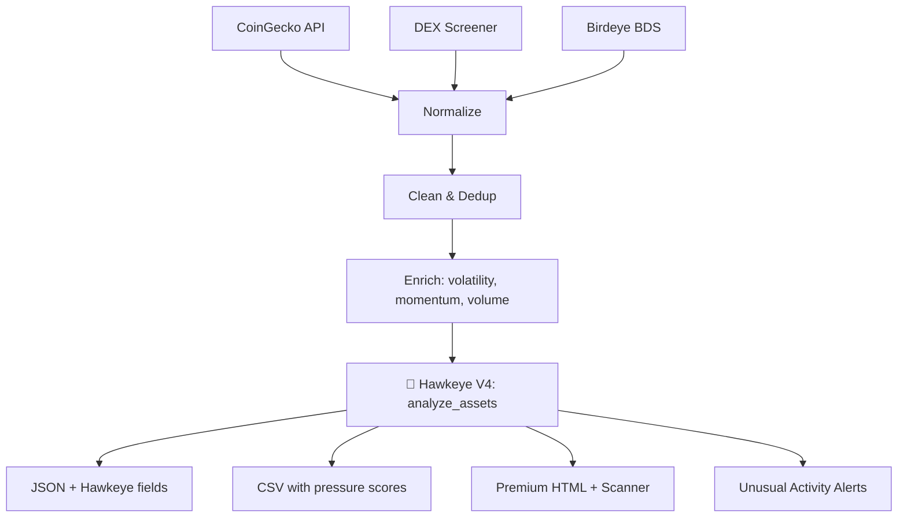

# 🦅 Atlas Nexus — Birdeye Data BIP Sprint 4 Enhanced

[](https://github.com/AtlasNexusOps/birdeye-sprint4/actions) [](https://opensource.org/licenses/MIT)


**Multi-source crypto analytics pipeline + Hawkeye V4 Market Pressure Radar**

Built for the [Birdeye Data 4-Week BIP Competition Sprint 4](https://superteam.fun/earn/listing/birdeye-data-4-week-bip-competition-sprint-4)  
💰 **$500 USDC** · Deadline: May 16, 2026

## 🆕 Sprint 4 Enhanced — Hawkeye V4 Integration

| Feature | Sprint 3 | Sprint 4 | **Enhanced** |
|---------|----------|----------|-------------|
| Sources | CoinGecko + Birdeye | + DEX Screener + Trending | Same |
| Enrichment | Volatility + MCap tiers | + Momentum + Unusual volume | **+ Hawkeye V4 pressure radar** |
| Technical Analysis | None | Basic trend detection | **EMA/RSI/MACD/ATR/nROC** |
| Scoring | Simple momentum | Trend classification | **0-100 pressure score per token** |
| Dashboard | Basic stats | Interactive HTML | **Premium theme + Hawkeye scanner** |
| Alerts | None | Gainers/losers | **Extension/RSI/volatility alerts** |

## 🦅 Hawkeye V4 — Market Pressure Radar

Hawkeye V4 analyzes each token through 7 signal families:

| Family | Weight | What it measures |
|--------|--------|-----------------|
| **Trend** | 25% | EMA alignment, MACD histogram |
| **Momentum** | 25% | RSI, normalized RoC (5 & 20 period) |
| **Volatility** | 20% | ATR percentile, extension from mean |
| **Volume** | 15% | Volume confirmation |
| **Pattern** | 10% | Price structure |
| **Sentiment** | 3% | Breadth/participation |
| **Quality** | 2% | Data completeness |

**Doctrine:** Regime first → pressure second → signal family third → score last.  
Hawkeye is a market-pressure radar, **not a trade placement tool**.

## 🏗️ Architecture



## 🚀 Quick Start

```bash
git clone https://github.com/AtlasNexusOps/birdeye-sprint4.git
cd birdeye-sprint4

# 🌐 Live Dashboard (browser, zero install)
open enhanced_dashboard.html
# Or visit: https://atlasnexusops.github.io/birdeye-sprint4/

# 🐍 Run Python pipeline (zero deps beyond stdlib)
python sprint4_pipeline.py

# 🔍 Token Discovery Engine
python discovery_engine.py

# Outputs in output/
```

## 📊 What the Pipeline Produces

| File | Contents |
|------|----------|
| `tokens_full_{ts}.json` | All tokens with Hawkeye pressure scores, regimes, signal families |
| `summary_{ts}.json` | Market summary + Hawkeye aggregate stats |
| `tokens_{ts}.csv` | Flat CSV with pressure_score, pressure_direction, h_rsi, h_nroc5 |
| `dashboard_{ts}.html` | Premium HTML dashboard with Hawkeye V4 scanner embedded |

## 🗂️ File Map

```
birdeye-sprint4/
├── sprint4_pipeline.py      # Main enhanced pipeline (Hawkeye V4 integrated)
├── hawkeye_core.py          # 🦅 Hawkeye V4 market pressure radar core
├── sentiment.py             # Pressure visualization & scanner HTML components
├── dashboard_theme.py       # Premium Atlas Nexus CSS theme
├── bds_pipeline.py          # BDS data pipeline (legacy)
├── discovery_engine.py      # Token discovery (trending, breakouts, gems)
├── scanner_generator.py     # Dynamic scanner HTML generation
├── scanner_inject.py        # Scanner injection into dashboard
├── live_streamer.py         # Real-time price streamer (Yahoo Finance)
├── enhanced_dashboard.html  # Live interactive dashboard (Chart.js)
├── index.html               # Landing page with scanner placeholders
├── requirements.txt         # Zero extra deps (stdlib only)
└── output/                  # Generated exports
```

## ✨ Key Features

### 🦅 Hawkeye V4 Integration
- **7 signal families** weighted scoring per token
- **Pressure direction**: bullish / bearish / neutral
- **Extension warnings**: ATR-based over-extension detection
- **Regime classification**: trend, momentum, compression, volatile
- **nROC5/nROC20**: normalized rate of change for cross-asset comparison

### 🔮 Enhanced Dashboard
- Live data from CoinGecko API (auto-refresh)
- **4 interactive Chart.js charts**
- **Hawkeye V4 pressure scanner** with bullish/bearish boards
- Smart search + 8 category filters
- Column sorting, responsive design
- Unusual activity alerts (extension, RSI, volatility)

### 🔍 Discovery Engine
- CoinGecko Trending + DEX Screener Latest
- Breakout (>15%) / Crash (<-15%) detection
- Unusual volume alerts (>3σ)
- JSON export + human-readable alert feed

## 📁 Deliverables Checklist

- [x] Multi-source pipeline (CoinGecko + DEX Screener + Birdeye BDS)
- [x] Data cleaning & normalization
- [x] Advanced enrichment & momentum scoring
- [x] **🦅 Hawkeye V4 market pressure radar (EMA/RSI/MACD/ATR/nROC)**
- [x] Market intelligence & sentiment
- [x] JSON + CSV + **Premium HTML Dashboard** export
- [x] Live interactive dashboard (Chart.js, search, filters, alerts)
- [x] Token Discovery Engine (breakout/crash/volume alerts)
- [x] GitHub Pages deployed
- [x] Zero dependencies beyond Python stdlib
- [x] Birdeye BDS integration (API key)

## 👤 Submission

**Author:** Atlas Nexus (AtlasNexusOps)  
**Contact:** atlasnexus.ops@proton.me  
**Sprint 3 Ref:** https://github.com/AtlasNexusOps/birdeye-sprint
**Markets Dashboard:** https://github.com/AtlasNexusOps/markets-dashboard
