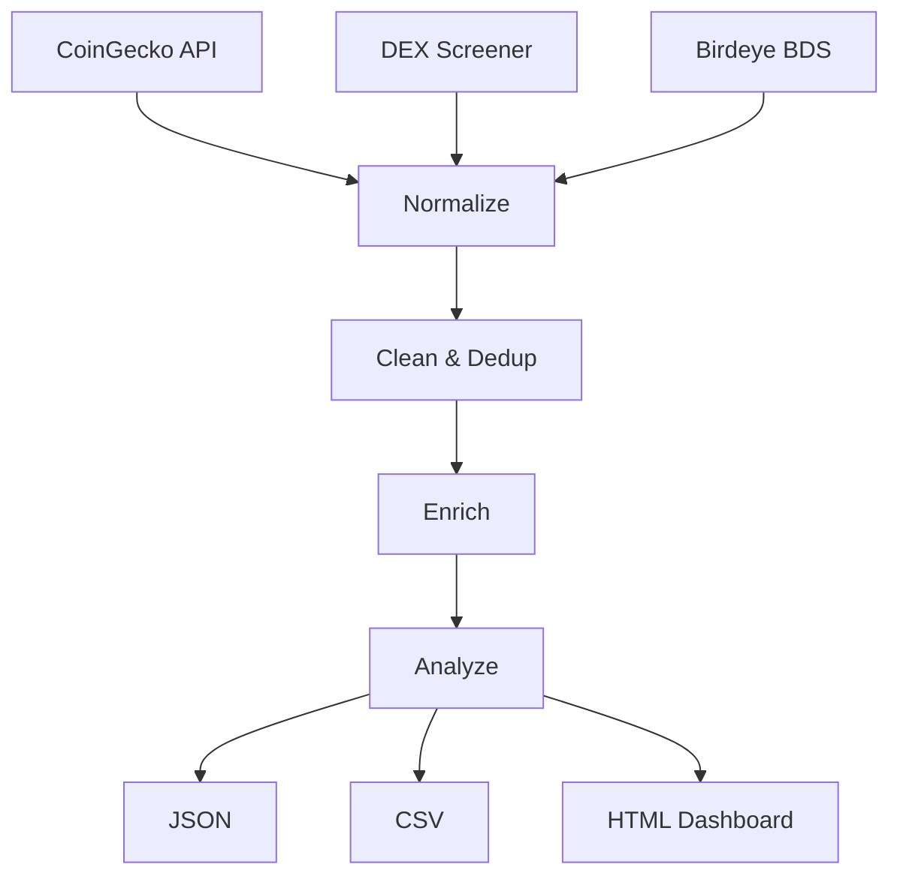

# 🚀 Atlas Nexus — Birdeye Data BIP Sprint 4

**Multi-source crypto analytics pipeline + interactive dashboard**

Built for the [Birdeye Data 4-Week BIP Competition Sprint 4](https://superteam.fun/earn/listing/birdeye-data-4-week-bip-competition-sprint-4)  
💰 **$500 USDC** · Deadline: May 16, 2026

## 🆕 Sprint 4 vs Sprint 3

| Feature | Sprint 3 | Sprint 4 |
|---------|----------|----------|
| Sources | CoinGecko + Birdeye | **+ DEX Screener + Trending** |
| Enrichment | Volatility + MCap tiers | **+ Momentum scoring + Unusual volume** |
| Market Intel | Basic stats | **+ Sentiment analysis + Trend detection** |
| Export | JSON + CSV | **+ Interactive HTML Dashboard** |
| Token Discovery | None | **+ Top gainers/losers + Hidden gems** |

## 🏗️ Architecture



## 🚀 Quick Start

```bash
# Clone + open (zero install needed for dashboard)
git clone https://github.com/AtlasNexusOps/birdeye-sprint4.git
cd birdeye-sprint4

# 🌐 Live Dashboard (works instantly)
open enhanced_dashboard.html
# Or visit: https://atlasnexusops.github.io/birdeye-sprint4/

# 🐍 Run Python pipeline
pip install -r requirements.txt
python sprint4_pipeline.py

# 🔍 Token Discovery Engine
python discovery_engine.py

# Outputs in output/
```

## ✨ New in v2 (May 12)

### 🛢️📈💱 Markets Expansion — Commodities, Indices & Forex

Three new pipelines + dashboards tracking traditional markets via Yahoo Finance:

| Market | Assets | Pipeline | Dashboard |
|--------|--------|----------|-----------|
| 🛢️ Commodities | Gold, Silver, Oil, Copper, Wheat, Coffee... (15) | `commodities_pipeline.py` | `commodities_dashboard.html` |
| 📈 Indices | S&P 500, Nasdaq, FTSE 100, DAX, Nikkei... (16) | `indices_pipeline.py` | `indices_dashboard.html` |
| 💱 Forex | EUR/USD, GBP/JPY, USD/CHF... (19 pairs) | `forex_pipeline.py` | `forex_dashboard.html` |

**Master pipeline** (`master_pipeline.py`) runs all 4 markets (Crypto + Commodities + Indices + Forex).

### 🔮 Enhanced Live Dashboard (`enhanced_dashboard.html`)
- **Live data** — fetches from CoinGecko API every 60s
- **4 interactive charts** — Market Cap donut, Volatility bars, Top 10 bar chart, Momentum distribution
- **Smart search** + 8 category filters (Gainers, Losers, Large/Mid/Small Cap, Hidden Gems, High Vol)
- **Column sorting** — click any header
- **Top 10 Gainers/Losers** with gold/silver/bronze rankings
- **Smart Alerts** — auto-detects breakouts (>15%), crashes, unusual volume, hidden gems
- **Responsive** — dark theme, works on mobile

### 🔍 Discovery Engine (`discovery_engine.py`)
- Real-time token radar (CoinGecko Trending + DEX Screener)
- Breakout/crash detection with acceleration analysis
- Unusual volume alerts (>3x average)
- JSON export + human-readable alert feed (Telegram/Discord ready)

### 1. Token Dataset (100+ tokens)
- Unified schema across CoinGecko, DEX Screener, Birdeye
- Cleaned, deduplicated, nulls handled
- Enriched with volatility, momentum, volume flags

### 2. Market Intelligence
- Sentiment analysis (STRONG_UP → STRONG_DOWN)
- Unusual volume detection
- Market cap distribution
- Top gainers/losers

### 3. Interactive HTML Dashboard
- Real-time token leaderboard
- Color-coded performance
- Gainers vs losers section
- Unusual volume alerts
- Responsive design (mobile-friendly)

## 📁 Deliverables Checklist

- [x] Multi-source data pipeline (CoinGecko + DEX Screener + Birdeye BDS)
- [x] Data cleaning & normalization
- [x] Advanced enrichment & analytics
- [x] Market intelligence & trend detection
- [x] JSON + CSV + HTML Dashboard export
- [x] **Live interactive dashboard** (Chart.js, search, filters, alerts)
- [x] **Token Discovery Engine** (breakout/crash/volume alerts)
- [x] **GitHub Pages deployed** — [atlasnexusops.github.io/birdeye-sprint4](https://atlasnexusops.github.io/birdeye-sprint4/)
- [x] Zero dependencies beyond stdlib + requests
- [x] Birdeye BDS integration (API key)
- [x] Production-ready error handling

## 👤 Submission

**Author:** Atlas Nexus (AtlasNexusOps)  
**Contact:** atlasnexus.ops@proton.me  
**Sprint 3 Ref:** https://github.com/AtlasNexusOps/birdeye-sprint
