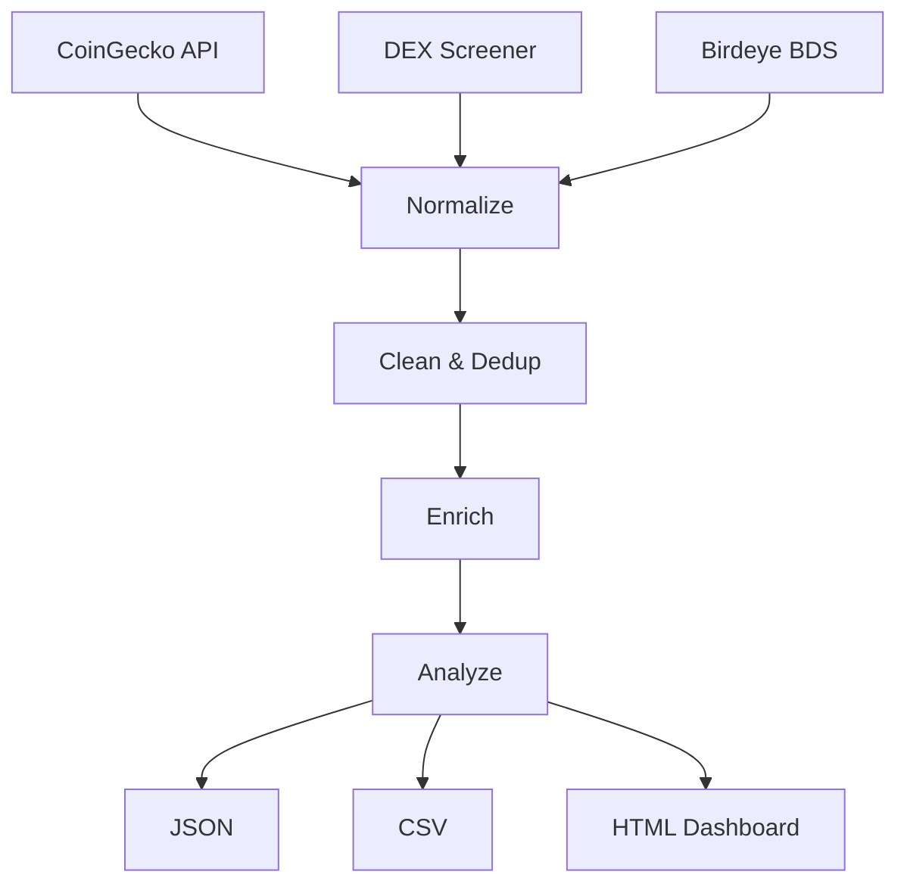

# 🚀 Atlas Nexus — Birdeye Data BIP Sprint 4

**Multi-source crypto analytics pipeline + interactive dashboard**

Built for the [Birdeye Data 4-Week BIP Competition Sprint 4](https://superteam.fun/earn/listing/birdeye-data-4-week-bip-competition-sprint-4)  
💰 **$500 USDC** · Deadline: May 16, 2026

## 🆕 Sprint 4 vs Sprint 3

| Feature | Sprint 3 | Sprint 4 |
|---------|----------|----------|
| Sources | CoinGecko + Birdeye | **+ DEX Screener + Trending** |
| Enrichment | Volatility + MCap tiers | **+ Momentum scoring + Unusual volume** |
| Market Intel | Basic stats | **+ Sentiment analysis + Trend detection** |
| Export | JSON + CSV | **+ Interactive HTML Dashboard** |
| Token Discovery | None | **+ Top gainers/losers + Hidden gems** |

## 🏗️ Architecture



## 🚀 Quick Start

```bash
# Install (zero extra deps)
pip install -r requirements.txt

# Run with free sources
python sprint4_pipeline.py

# Run with Birdeye BDS
python sprint4_pipeline.py --birdeye YOUR_API_KEY

# Outputs in output/
```

## 📊 What It Produces

### 1. Token Dataset (100+ tokens)
- Unified schema across CoinGecko, DEX Screener, Birdeye
- Cleaned, deduplicated, nulls handled
- Enriched with volatility, momentum, volume flags

### 2. Market Intelligence
- Sentiment analysis (STRONG_UP → STRONG_DOWN)
- Unusual volume detection
- Market cap distribution
- Top gainers/losers

### 3. Interactive HTML Dashboard
- Real-time token leaderboard
- Color-coded performance
- Gainers vs losers section
- Unusual volume alerts
- Responsive design (mobile-friendly)

## 📁 Deliverables Checklist

- [x] Multi-source data pipeline
- [x] Data cleaning & normalization
- [x] Advanced enrichment & analytics
- [x] Market intelligence & trend detection
- [x] JSON + CSV + HTML Dashboard export
- [x] Zero dependencies beyond stdlib + requests
- [x] Birdeye BDS integration (API key)
- [x] DEX Screener trending integration
- [x] Production-ready error handling

## 👤 Submission

**Author:** Atlas Nexus (AtlasNexusOps)  
**Contact:** atlasnexus.ops@proton.me  
**Sprint 3 Ref:** https://github.com/AtlasNexusOps/birdeye-sprint
